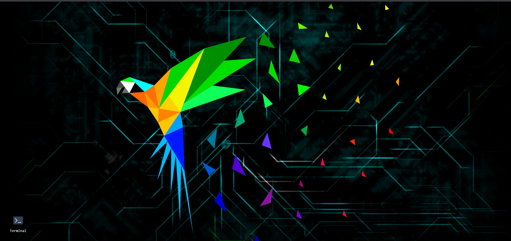
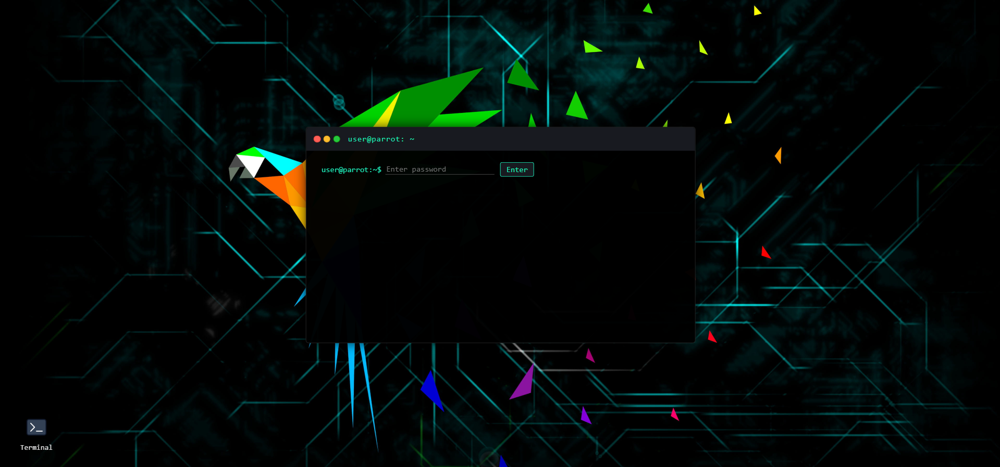

# Parrot Terminal Password Auditor

A Parrot OS–themed web app for auditing password strength and checking for breaches, featuring a desktop-style wallpaper, a clickable terminal icon, and a realistic terminal window with a typewriter effect.

---

## 🚀 Features

- **Parrot OS–style web desktop** with wallpaper and terminal icon
- **Realistic terminal window** with colored prompt and result
- **Typewriter animation** for output
- **Password strength analysis** (entropy, length, character set)
- **Breach check** using HaveIBeenPwned API
- **No passwords are stored**
- **Responsive design** for desktop and mobile

---


## ⚡ Quick Start

### 1. **Clone the repo**

bash
```
git clone https://github.com/yourusername/parrot-terminal-password-auditor.git
```
```
cd parrot-terminal-password-auditor/src
```

### 2. **Set up a virtual environment**

bash
```python -m venv venv```
# On Windows:
```venv\Scripts\activate```
# On Mac/Linux:
```source venv/bin/activate```


### 3. **Install dependencies**

```bash
pip install flask requests
```

### 4. **Run the app**

```bash
python webapp.py
```

### 5. **Open in your browser**

Go to [http://127.0.0.1:5000/](http://127.0.0.1:5000/)

---

## 🛡️ Security & Privacy

- Passwords are **never stored** or logged.
- Breach checks use the [HaveIBeenPwned k-Anonymity API](https://haveibeenpwned.com/API/v3#SearchingPwnedPasswordsByRange) (no full password or hash is sent).

---

## 🖼️ Customization

- **Wallpaper:** Replace `src/static/peakpx.jpg` with your favorite Parrot OS or Linux wallpaper.
- **Terminal icon:** Replace `src/static/terminal.png` with any terminal icon you like.
- **Prompt:** Edit the prompt in `index.html` for your own username/hostname.

---

## 📸 Screenshots

> 
>  

---

## 📝 Credits

- Inspired by [Parrot OS](https://www.parrotsec.org/)
- Terminal icon from [Icons8](https://icons8.com/icons/set/terminal) or [Parrot OS Press Kit](https://www.parrotsec.org/press-kit/)
- Wallpaper from [peakpx.com](https://www.peakpx.com/) or your own source
- Password breach check via [HaveIBeenPwned](https://haveibeenpwned.com/)

---


## 🤝 Contributing

Pull requests and suggestions are welcome!  
Open an issue or submit a PR.

---

## 💡 Author

- [Neo_X](https://github.com/QuantumRobot243)

